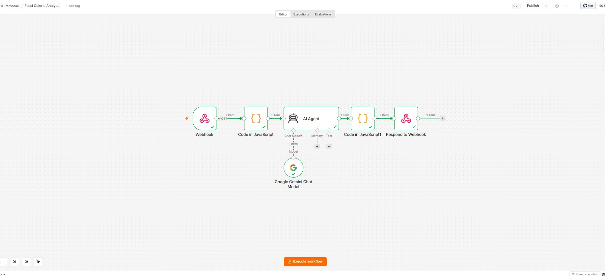
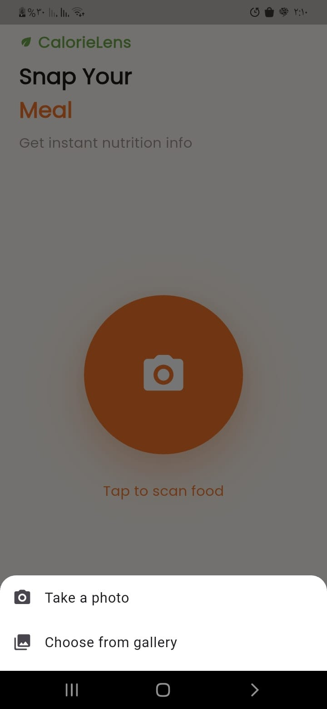
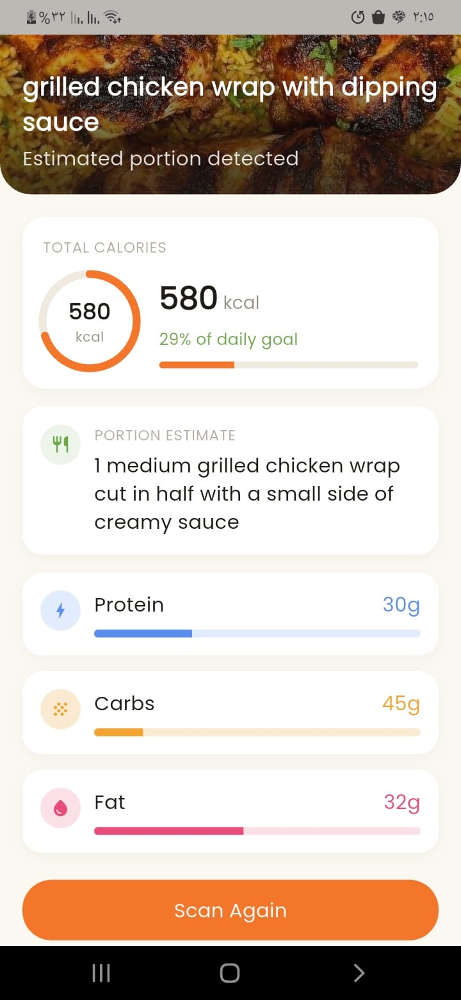

# 🍽️ Food Calorie Scanner

A Flutter app that lets you snap a photo of your meal and instantly get an AI-powered breakdown of its calories, protein, carbs, and fat — powered by an **n8n** workflow running Google Gemini Vision under the hood.

---

## 🔄 How It Works (Workflow)

The image is sent to an **n8n** webhook, analyzed by an **AI Agent** node (Google Gemini Chat Model), parsed, and the structured nutrition data is sent back to the app.

<p align="center">
  
</p>

**Flow:**
```
Flutter App → Webhook → Prepare Image → AI Agent (Gemini) → Code (parse JSON) → Respond to Webhook → Flutter App
```

---

## 📱 Screenshots
<div align="center">
  
  </div>


<div align="center">
  &nbsp;&nbsp;
  
  &nbsp;&nbsp;
  
  &nbsp;&nbsp;

  

</div>

---

## 🏗️ Architecture

This project follows **Clean Architecture** principles with a clear separation of concerns across three layers:

```
lib/
├── core/
│   ├── utils/
│   │   ├── colors/          # App color palette
│   │   ├── styles/          # Text styles
│   │   ├── widgets/         # Shared reusable widgets
│   │   ├── router/          # go_router configuration
│   │   ├── service/         # API service (Dio wrapper)
│   │   ├── service_locator/ # Dependency injection (get_it)
│   │   └── helper/          # Image picker helper, etc.
│   └── errors/
│       └── failures.dart    # Failure classes (used with dartz)
│
└── feature/
    └── scan_food/
        ├── data/
        │   ├── data_source/     # Remote data source (API calls)
        │   ├── model/           # JSON serializable models
        │   └── repo_impl/       # Repository implementation
        ├── domain/
        │   ├── entity/          # Pure business objects
        │   ├── repo/            # Repository contracts (interfaces)
        │   └── usecase/         # Business logic use cases
        └── presentation/
            ├── cubit/           # State management (flutter_bloc)
            ├── widgets/         # UI components
            └── views             # Screens (Scan / Result)
```

**Data flow:**
```
UI → Cubit → UseCase → Repository (interface) → RepositoryImpl → RemoteDataSource → ApiService → n8n Webhook
```

Error handling is done functionally using `dartz`'s `Either<Failure, Success>`, so every layer above the data source deals with clean, predictable results instead of try/catch blocks scattered everywhere.

---

## ⚙️ Tech Stack & Packages

| Package | Purpose |
|---|---|
| `flutter_bloc` / `bloc` | State management (Cubit) |
| `equatable` | Value comparison for states |
| `dartz` | Functional error handling (`Either<Failure, Success>`) |
| `get_it` | Dependency injection / service locator |
| `dio` | HTTP client for calling the n8n webhook |
| `go_router` | Declarative navigation |
| `image_picker` | Capturing/selecting meal photos |
| `google_fonts` | Custom typography |
| `cupertino_icons` | iOS-style icons |

```yaml
dependencies:
  cupertino_icons: ^1.0.8
  go_router: ^17.3.0
  dio: ^5.10.0
  get_it: ^9.2.1
  google_fonts: ^8.1.0
  dartz: ^0.10.1
  flutter_bloc: ^9.1.1
  bloc: ^9.2.1
  equatable: ^2.1.0
  image_picker: ^1.2.3
```

---

## 🚀 Getting Started

1. Clone the repo
   ```bash
   git clone https://github.com/your-username/food-calorie-scanner.git
   cd food-calorie-scanner
   ```

2. Install dependencies
   ```bash
   flutter pub get
   ```

3. Update the n8n webhook URL in the remote data source:
   ```dart
   static const String _webhookUrl = 'https://your-n8n-instance.app/webhook/analyze-food';
   ```

4. Run the app
   ```bash
   flutter run
   ```

---

## 🧠 Backend (n8n)

The AI analysis pipeline is built entirely with **n8n**, using:
- **Webhook** — receives the base64-encoded image from the app
- **Code node** — prepares the payload
- **AI Agent** (Google Gemini Chat Model) — analyzes the food image and estimates nutrition values
- **Code node** — parses the model's JSON response
- **Respond to Webhook** — returns the structured result to the app

Sample response:
```json
{
  "food_name": "Beef Pot Roast with Gravy, Mashed Potatoes, and Green Beans",
  "calories": 720,
  "protein_g": 42,
  "carbs_g": 54,
  "fat_g": 38,
  "portion_estimate": "1 large dinner plate containing approximately 150g of beef, 1 cup of mashed potatoes, and 100g of green beans."
}
```

---

## 📄 License

This project is for educational/personal use. Feel free to fork and build on top of it.